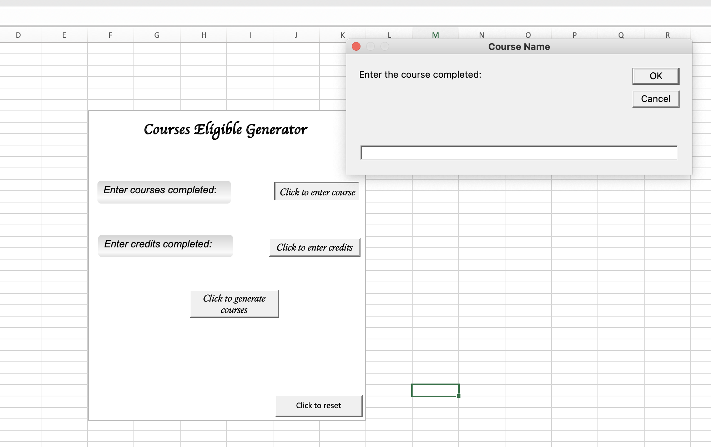
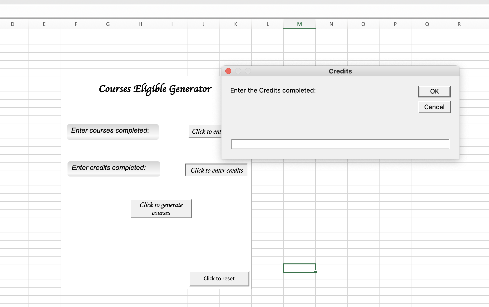
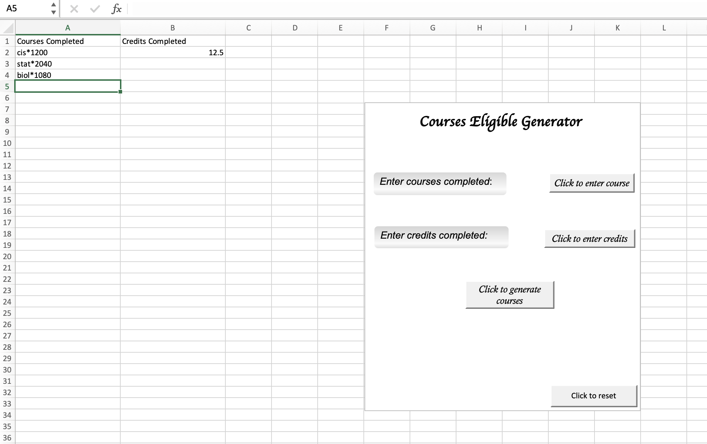

# F23_CIS3760_101

# Team

-   Team Lead:
    -   Simardeep Singh
-   Team Members:
    -   Sara Adi
    -   Emily Kozatchiner
    -   Fee Kim Ah-Poa
    -   Maneesh K. Wijewardhana

## How to Run

1. Navigate to the VBASprint2 directory
2. Open the Microsoft Excel file which contains the UI and parsed courses (make sure to enable macros)
3. Navigate to the input courses sheet and input your completed courses and credits completed
4. Click the generate eligible courses button ()
    - This will take around 20 seconds due to parsing all courses in the parsed_courses data sheet
5. Navigate to the Eligible Courses sheet and view courses
6. Before inputting different courses, make sure to click the reset button to clear the Eligible Courses sheet

## Name

Sprint 2

## Description

F23 CIS\*3760 Sprint 2:

The purpose of this sprint was to have an Excel UI that the student can enter their courses in, then have an output of the courses they are eligible to take are.

The criteria that we needed to meet were:

-   The UI is easy to use
-   Have multiple sheets (all course data, input courses, output courses)
-   Only use VBA to generate courses

## Visuals

## Team Approach

This project had multiple parts to it:

1.  Re-parse prerequisites in the parser script so it would be easy to use in VBA
2.  Parse out restrictions in the parser script so that eligibility criteria can be met for the student
3.  Create an easy to use Excel UI with buttons and input cells
    -   This included having inputs for completed courses and completed credits
4.  Create VBA scripts that parse out the prerequisites and check if the student is eligible to take a course, if so, add it to the sheet

Currently, this VBA script only works on Windows due to utilizing regex

## Authors and acknowledgment

    - Sara Adi
    - Emily Kozatchiner
    - Fee Kim Ah-Poa
    - Maneesh K. Wijewardhana
    - Simardeep Singh

## Project status

Completed
