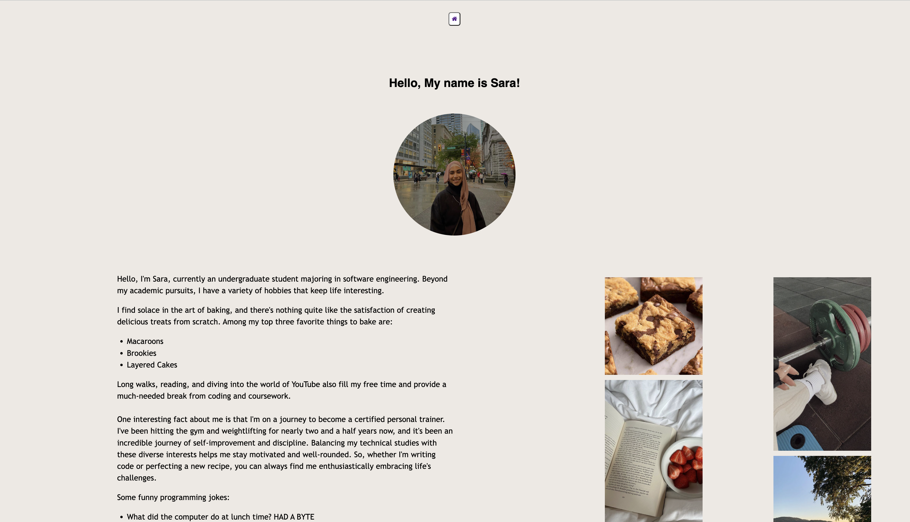
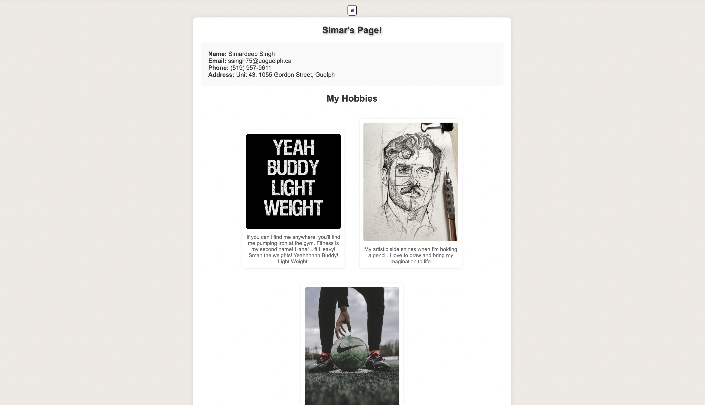
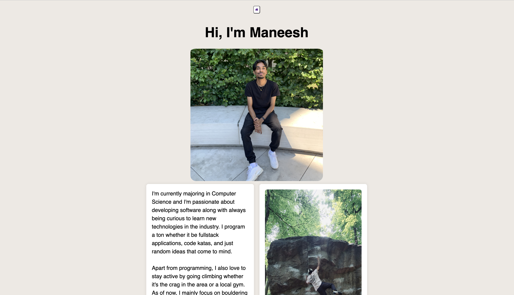
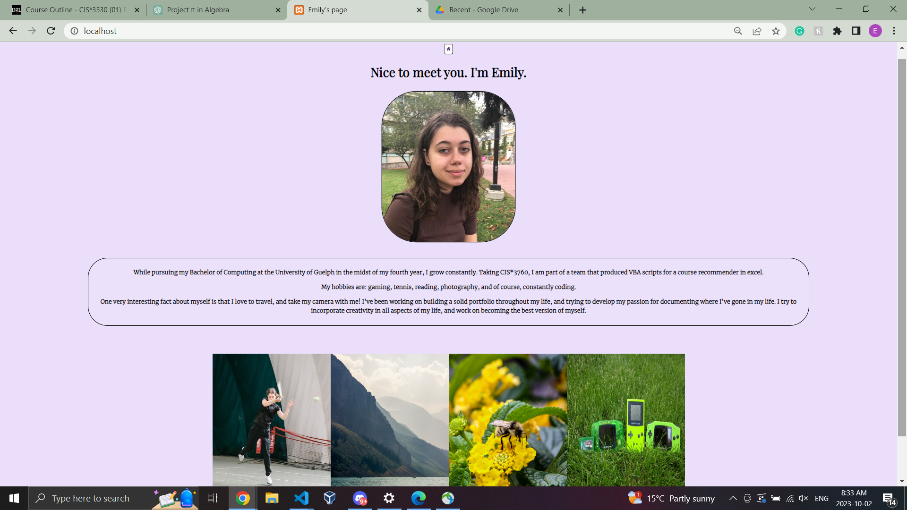

# F23_CIS3760_101

# Team

-   Team Lead:
    -   Simardeep Singh
-   Team Members:
    -   Sara Adi
    -   Emily Kozatchiner
    -   Fee Kim Ah-Poa
    -   Maneesh K. Wijewardhana

## How to Run

1. Start the server by visiting https://cis3760f23-01.socs.uoguelph.ca/. This will launch the website.
2. Click on the profile photos of team members to view the results of their PHP scripts in the form of web pages.
3. When you enter a team member's webpage, use the "Home" button at the top to return to the homepage.
4. On homepage, click the "Download" button to download an Excel spreadsheet.
5. Try entering an invalid address, and the 404 error page will be displayed.
6. On the 404 error page, click "Home" to return to the homepage.

## Name

Sprint 3

## Description

F23 CIS\*3760 Sprint 3:

The objective of this sprint was to create a web interface that includes a homepage from where users can download Excel spreadsheets. Additionally, another task was to showcase the personal webpages of team members, which can be easily accessed through the homepage.

The criteria that we needed to meet were"
-   Host homepage
-   Describe Excel spreadsheet
-   Host Individual pages of team members

## Visuals
1. Home Page

2. 404 Page

3. Team's Personal Pages

## Team Approach

1. The entire team collaborated closely throughout the project.
2. MS Teams was utilized for continuous communication, which was essential.
3. Team members were accountable for completing their respective scripts.
4. We created a website prototype using Figma before proceeding with implementation.
5. Our primary focus was on user experience and simplicity, which we prioritized.

## Authors and acknowledgment

    - Sara Adi
    - Emily Kozatchiner
    - Fee Kim Ah-Poa
    - Maneesh K. Wijewardhana
    - Simardeep Singh

## Project status

Completed
