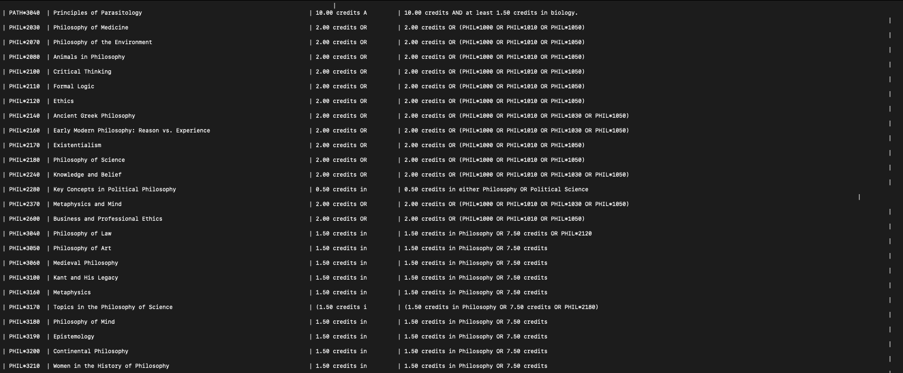

# F23_CIS3760_101

# Team

-   Team Lead:
    -   Emily Kozatchiner
-   Team Members:
    -   Sara Adi
    -   Simardeep Singh
    -   Fee Kim Ah-Poa
    -   Maneesh K. Wijewardhana

## How to Run
Please reference the following files existing in the sprint4_docs folder:
-   the API.md file for the associated URLs of the API calls in POSTMAN
-   the my_sql_use.md file for the creation and copying of the cis3760 database table.

The two documents state clear instructions on how to operate the database and all the API calls associated with them.

## Current Sprint

Sprint 4

## Description

F23 CIS\*3760 Sprint 4:

The objective of this sprint is to design and create a navigable MySQL database using the VM provided. To do so, we need to establish server side REST API to access and modify the database. Documentation the API calls for database manipualtion should be provided. 

The criteria that we needed to meet were:
-   Transfer all course data from excel to the VM MySQL database
-   Create a server side REST API in PHP
-   Presenting documentation and examples on how to interact with the database with REST API

## Visuals
MariaDB: Database creation and usage

 

POSTMAN: API call example

## Team Approach
Approaching the sprint, we had to set up a local development environment for the team. Coding on the VM would be inefficient and potentially dangerous, so before approaching outstanding tasks, the team set-up their environment.

The sprint was divided into two sections: 
1. The creation and population of a new database in MySQL that holds all given csv file information
2. The connection of the database to establish the four main API calls in PHP scripts

Database task featured brainstorming on design on both the database and table organization, research on how to use MariaDB, and creation of the populated database.

For the API calls, we had multiple subtasks that everyone would take on to complete full communication between the database.
-   Establishing the connection to the database was done by Maneesh
-   GET request calls were done by Maneesh
-   POST request calls were done by Simardeep
-   PUT request calls were done by Fee Kim
-   DELETE request calls were done by Maneesh

We also accounted for various different database queries within these calls, and had to decide which fields were required to be present and which were not.

## Authors and acknowledgment

    - Sara Adi
    - Emily Kozatchiner
    - Fee Kim Ah-Poa
    - Maneesh K. Wijewardhana
    - Simardeep Singh

## Project status

Complete.

